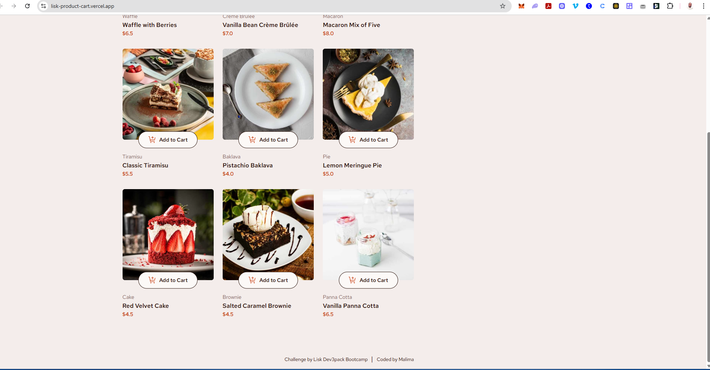

# dev3pack-lisk-product-cart

A React + Vite application for managing a product catalog with an interactive shopping cart. This project demonstrates modern frontend development practices using TypeScript, ESLint, and fast build tools like SWC.

## Overview

This project is a minimal yet functional e-commerce storefront built with **React** and **Vite**, featuring:

- A responsive product catalog
- Add-to-cart functionality
- Real-time cart updates
- Clean, maintainable codebase using **TypeScript**
- Fast builds powered by **SWC**

### Live Demo

You can view the live deployment at: [lisk-product-cart.vercel.app](https://lisk-product-cart.vercel.app)


*Preview of the deployed application*


## Features

- **Product Catalog:** Displays a grid of products with images, names, descriptions, and prices.
- **Add to Cart:** Each product has an "Add to Cart" button that adds the item to the shopping cart.
- **Shopping Cart:** Tracks selected items and their quantities in real time.
- **Responsive Design:** Optimized for both desktop and mobile devices.
- **Type Safety:** Built with TypeScript for robust type checking and developer productivity.
- **Fast Builds:** Leverages SWC for up to **20x faster builds** compared to Babel.


## Getting Started

### 1. Clone the Repository

```bash
git clone https://github.com/your-username/dev3pack-lisk-product-cart.git
cd dev3pack-lisk-product-cart
```

### 2. Install Dependencies

```bash
npm install
```

### 3. Start the Development Server

```bash
npm run dev
```

Open [http://localhost:5173](http://localhost:5173) in your browser to see the app.

### 4. Build for Production

```bash
npm run build
```

This generates a production-ready bundle in the `dist/` folder.

### 5. Preview Production Build

```bash
npm run preview
```

Serves the built assets locally to test the production version.


## Project Structure

```
dev3pack-lisk-product-cart/
├── public/
│   └── vite.svg
├── src/
│   ├── assets/           # Images and other static assets
│   ├── components/       # Reusable UI components (e.g., ProductCard, ShoppingCart)
│   ├── hooks/            # Custom React hooks (e.g., useCart)
│   ├── styles/           # CSS or styled-components files
│   ├── App.jsx           # Main application component
│   ├── main.jsx          # Entry point for the React app
│   └── index.css         # Global styles
├── .eslintrc.cjs         # ESLint configuration
├── tsconfig.json         # TypeScript configuration
├── vite.config.js        # Vite configuration
├── package.json
└── README.md
```


## Configuration Details

### 1. TypeScript Setup

The project uses **TypeScript** for type safety and better developer experience. Key configurations include:

- **`tsconfig.json`**: Configures TypeScript compiler options.
- **`eslint-plugin-typescript-eslint`**: Enables ESLint to work seamlessly with TypeScript.

### 2. ESLint & Prettier

- **ESLint**: Ensures code quality and consistency.
- **Prettier**: Handles code formatting automatically.
- **Husky + lint-staged**: Runs linters on git commits to maintain code quality.

### 3. Fast Builds with SWC

The project leverages **SWC (Speedy Web Compiler)** for ultra-fast builds:

- **Why SWC?**
  - Up to **20x faster than Babel** on single-threaded performance.
  - Rust-based compiler for superior speed and reliability.
  - Supports modern JavaScript and TypeScript features.

To enable SWC, the following plugins are used:
- `@vitejs/plugin-react-swc`: For React Fast Refresh.
- `@swc/core`: Core SWC library for compilation.

### 4. Vite Configuration

The `vite.config.js` file configures Vite for optimal performance, including:

- Development server settings.
- Build optimizations.
- Plugin integrations (e.g., React, SWC).


## Deployment

The application is deployed on **Vercel**. To deploy your own version:

1. **Create a Vercel Account** (if you don't have one).
2. **Import the Repository** into Vercel.
3. **Configure Environment Variables** (if needed).
4. **Deploy!**

Alternatively, you can deploy to other platforms like Netlify, GitHub Pages, or Cloudflare Pages by running:

```bash
npm run build
```

Then upload the contents of the `dist/` folder.


## Contributing

Contributions are welcome! If you find any bugs or want to enhance the project, feel free to open an issue or submit a pull request.

1. Fork the repository.
2. Create a new branch: `git checkout -b feature/new-feature`.
3. Make your changes and commit them: `git commit -m 'Add new feature'`.
4. Push to the branch: `git push origin feature/new-feature`.
5. Open a Pull Request.


## License

This project is licensed under the MIT License – see the [LICENSE](LICENSE) file for details.


## Credits

- **Challenge Provided By:** Lisk Dev3Pack Bootcamp
- **Coded By:** Malima
- **Tools Used:**
  - React
  - Vite
  - TypeScript
  - ESLint + Prettier
  - SWC
  - Husky + lint-staged


## Acknowledgements

- **Vite:** Next-generation frontend tooling.
- **React:** Library for building user interfaces.
- **TypeScript:** Strongly typed programming language for JavaScript.
- **ESLint + typescript-eslint:** Linting for JavaScript and TypeScript.
- **SWC:** Ultra-fast Rust-based compiler.
- **Vercel:** Hosting platform for deploying the application.